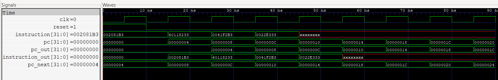

# 32-bit RV32I RISC-V Processor (Verilog)

## Overview

This project implements a modular 32-bit RV32I RISC-V processor using Verilog HDL. The processor was developed to understand processor architecture, RTL design, pipelining concepts, and digital verification.

Each hardware module was designed, tested, and verified independently before adding them into the processor.

---

## Features

- 32-bit RV32I Processor
- Program Counter (PC)
- Instruction Memory
- Register File (32 Registers)
- Arithmetic Logic Unit (ALU)
- Control Unit
- ALU Control Unit
- Immediate Generator
- Data Memory
- Single-Cycle Processor Integration
- Pipeline Registers
  - IF/ID
  - ID/EX
  - EX/MEM
  - MEM/WB
- Forwarding Unit
- Hazard Detection Unit
- Individual Testbenches
- GTKWave Verification

---

## Project Structure

```
RISCV_Processor/
│
├── rtl/
│   ├── pc.v
│   ├── instruction_memory.v
│   ├── register_file.v
│   ├── alu.v
│   ├── control_unit.v
│   ├── alu_control.v
│   ├── immediate_generator.v
│   ├── data_memory.v
│   ├── processor.v
│   ├── if_id.v
│   ├── id_ex.v
│   ├── ex_mem.v
│   ├── mem_wb.v
│   ├── forwarding_unit.v
│   ├── hazard_detection_unit.v
│   └── pipeline_processor.v
│
├── tb/
├── sim/
├── waveforms/
└── README.md
```

---

## Tools Used

- Verilog HDL
- Icarus Verilog
- GTKWave
- Visual Studio Code

---

## Simulation

The project was verified using Icarus Verilog and GTKWave.



---

## Learning Outcomes

- RTL Design
- Processor Architecture
- Pipeline Concepts
- Hazard Detection
- Data Forwarding
- Digital Verification
- Verilog Testbench Development

---

## Future Improvements

- Complete end-to-end 5-stage pipeline integration
- Branch handling and pipeline flushing
- Support for additional RV32I instructions
- Cache memory integration
- Performance analysis
